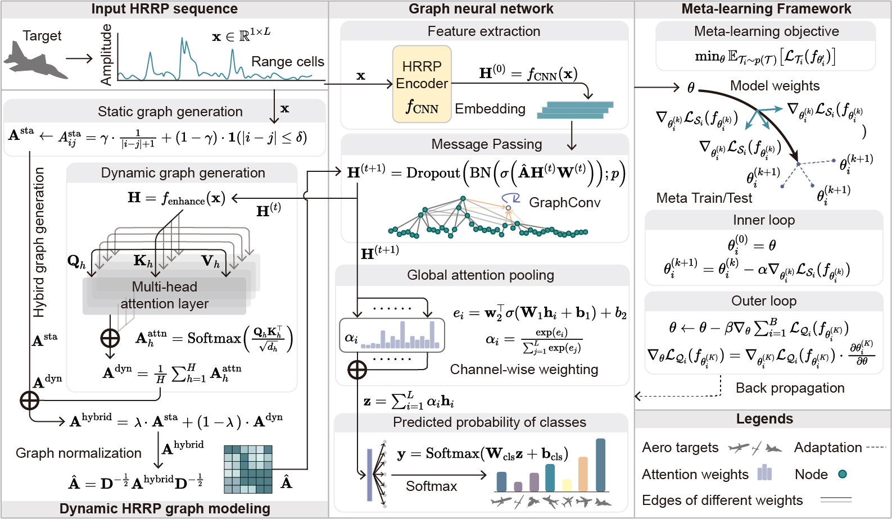

# HRRPGraphNet++ :satellite: 
**Manuscript currently under review of Remote Sensing 2025. We are still uploading the codes, please wait!**

HRRPGraphNet++ revolutionizes few-shot HRRP RATR through graph neural networks and meta-learning, achieving efficient radar target recognition :zap:.

---

> High-Resolution Range Profile (HRRP) radar recognition suffers from data scarcity challenges in operational settings. We present HRRPGraphNet++, a framework combining dynamic graph neural networks with meta-learning for few-shot HRRP recognition. Our approach generates graph representations dynamically through multi-head attention mechanisms that adapt to target-specific scattering characteristics, integrated with a specialized meta-learning framework employing layer-wise learning rates. Experiments demonstrate state-of-the-art performance in 1-shot (82.3%), 5-shot (91.8%), and 20-shot (94.7%) settings, with enhanced noise robustness (68.7% accuracy at 0dB SNR). Our hybrid graph mechanism combines physical priors with learned relationships, significantly outperforming conventional methods in challenging operational scenarios.
><p align="center">
  > 
</p>

---

## Platform :computer: 
Developed and tested on PyCharm with Conda environment. Recommended OS: Linux (Ubuntu 20.04/22.04 LTS).

---

## Getting Started :rocket:
```bash
git clone https://github.com/your-repo/HRRPGraphNet.git
cd HRRPGraphNet
conda create -n hrrpgn python=3.8
conda activate hrrpgn
pip install -r requirements.txt
```

---

## Dataset Structure :file_folder: 
Prepare HRRP data in the following structure:
```
data/
├── train/
│   ├── class1/
│   └── class2/
└── test/
    ├── classA/
    └── classB/
```

## Citation :blue_book:
If HRRPGraphNet inspires your research, please cite:
```bibtex
@article{chen2024hrrpgraphnet,
  title={HRRPGraphNet: Make HRRPs to be Graphs for Efficient Target Recognition},
  author={Chen, Lingfeng and Sun, Xiao and Pan, Zhiliang and Liu, Qi and Wang, Zehao and Su, Xiaolong and Liu, Zhen and Hu, Panhe},
  journal={Electronics Letters},
  volume={60},
  number={22},
  pages={e70088},
  year={2024},
  publisher={IET}
}
```

---

## License :scroll:
This project is licensed under the MIT License - see the [LICENSE](LICENSE) file for details.

---

## Contact :e-mail:
**Lingfeng Chen**  
:office: National University of Defense Technology  
:email: [chenlingfeng@nudt.edu.cn](mailto:chenlingfeng@nudt.edu.cn)  
:globe_with_meridians: [Personal Homepage](http://lingfengchen.cn/)  
